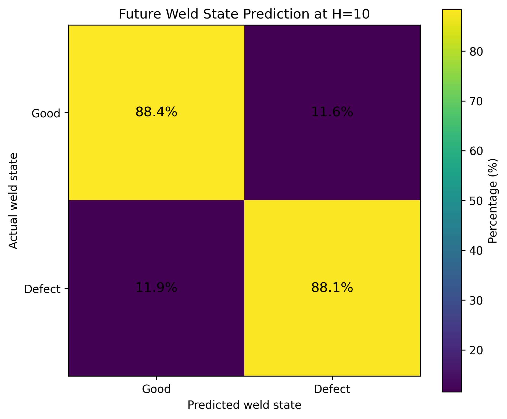
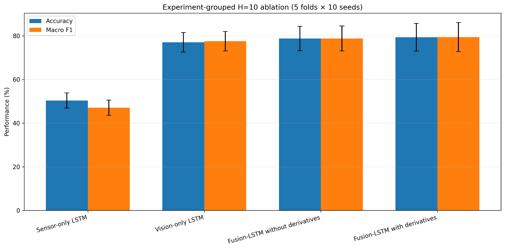
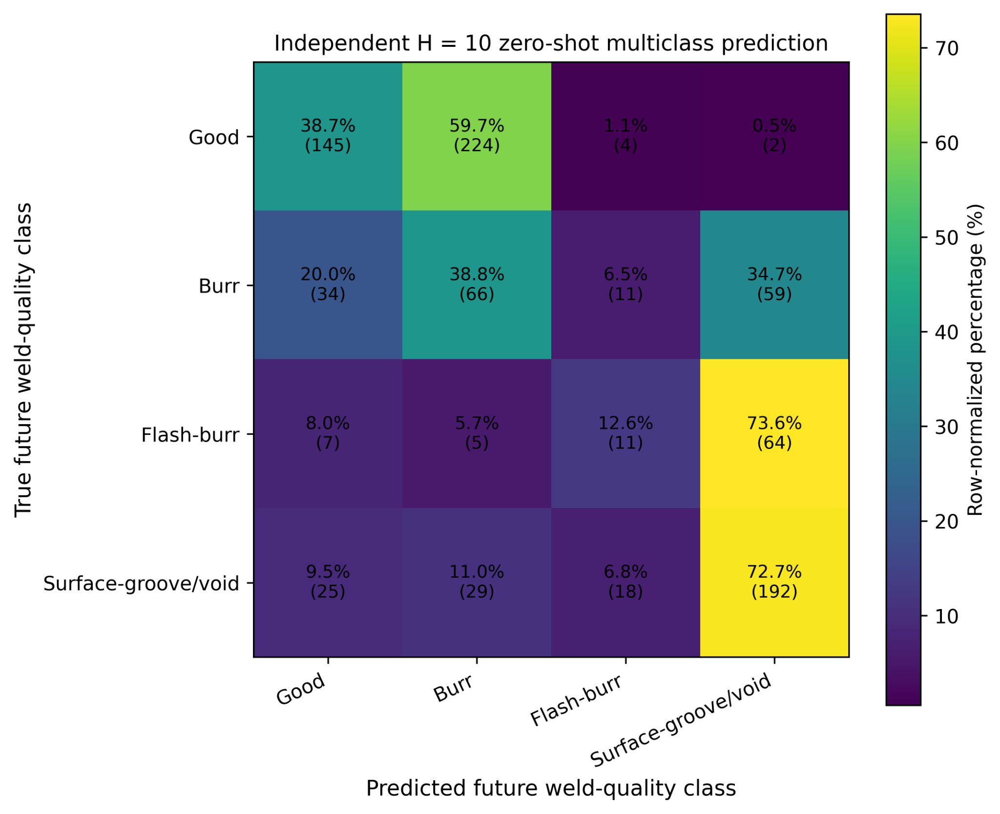

# Multimodal Future Weld-State Prediction for Friction Stir Welding

This repository contains the data-processing notebooks, Fusion-LSTM experiments,
ablation results, and independent zero-shot evaluation used to study future weld-quality
prediction in robotic friction stir welding (FSW).

The selected model uses a 20-frame multimodal history and predicts the weld-quality state
10 frames into the future. At 30 FPS, this corresponds to an approximately 0.333 s predictive
lead time.

## Model inputs and targets

- **Process signals:** axial force, spindle speed, torque, and temperature.
- **Vision features:** weld width, weld area, class-specific defect areas, and total defect area.
- **Temporal information:** first-order differences of the sensor and vision features.
- **Multiclass target:** Good, Burr, Flash-burr, or Surface-groove/void.
- **Binary target:** Good or Defect, obtained by collapsing the three defect classes.

## Headline H=10 results

### Final multiclass performance reported across ten seeds

| Metric | Mean ± SD (%) | 95% CI (%) |
|---|---:|---:|
| Accuracy | 83.57 ± 3.74 | 81.25-85.89 |
| Macro precision | 84.24 ± 3.02 | 82.37-86.11 |
| Macro recall | 85.86 ± 3.32 | 83.81-87.92 |
| Macro F1 | 84.21 ± 3.34 | 82.14-86.28 |
| Weighted F1 | 83.51 ± 3.70 | 81.22-85.81 |

These values are stored in
[`H10_overall_performance_summary.csv`](outputs/Final_Grouped_H10_Ablation_HorizonFolds_5Fold_10Seeds/Final_H10_Fusion_PerClass_Analysis/H10_overall_performance_summary.csv).
The corresponding per-class and consensus tables are included in the same directory. The
separately reported ablation benchmark below is retained as its own result set.

### Binary future weld-state performance

| Metric | Mean ± SD (%) | 95% CI (%) |
|---|---:|---:|
| Accuracy | 88.16 ± 3.77 | 85.82-90.49 |
| Macro F1 | 83.77 ± 4.85 | 80.76-86.78 |
| Defect recall | 88.09 ± 4.00 | - |

The binary result is calculated by collapsing Burr, Flash-burr, and
Surface-groove/void into the Defect class. No separate binary classifier was trained.
The confidence limits shown here are those stored in the final binary summary CSV.



## Experiment-grouped ablation benchmark

The supplied ablation artifacts contain five experiment-grouped outer folds and ten seeds.
Each seed contains 2,581 unique held-out sequences.

| Configuration | Features | Accuracy (%) | Macro F1 (%) |
|---|---:|---:|---:|
| Sensor-only LSTM | 8 | 50.36 ± 3.44 | 47.04 ± 3.49 |
| Vision-only LSTM | 12 | 77.01 ± 4.45 | 77.51 ± 4.46 |
| Fusion-LSTM without derivatives | 10 | 78.73 ± 5.57 | 78.77 ± 5.73 |
| Fusion-LSTM with derivatives | 20 | 79.32 ± 6.35 | 79.40 ± 6.67 |



## Independent zero-shot evaluation

The fixed H=10 model was evaluated on 896 matched samples from previously unseen
Experiments 12-14.

| Task | Accuracy (%) | Macro F1 (%) | Weighted F1 (%) |
|---|---:|---:|---:|
| Multiclass | 46.21 | 39.77 | 46.89 |
| Binary | 66.96 | 62.47 | 64.59 |



## Repository structure

```text
.
├── config/                  # Sanitized study settings
├── docs/                    # Reproducibility, results, and data documentation
├── external_test/           # Independent zero-shot data, metrics, and figures
├── notebooks/               # Ordered research notebooks
├── outputs/                 # Processed H=10 data and grouped-ablation artifacts
├── scripts/                 # Lightweight validation and figure-generation scripts
├── environment.yml
└── requirements.txt
```

## Quick start

```bash
git clone https://github.com/Naveen221195darwin/fsw-multimodal-prediction.git
cd fsw-multimodal-prediction
python -m venv .venv
```

On Windows PowerShell:

```powershell
.venv\Scripts\Activate.ps1
python -m pip install --upgrade pip
pip install -r requirements.txt
python scripts/validate_results.py
```

Run notebooks from the repository root so that their relative paths resolve correctly.
See [Reproducibility](docs/REPRODUCIBILITY.md) for the recommended execution order and
the distinction between included derived data and unavailable raw acquisition files.

## Data and privacy

Personal computer paths and notebook execution metadata have been removed. Raw videos,
COCO source JSON, and trained checkpoint files are not included. The repository contains
processed tabular data, scalers, out-of-fold predictions, final matched zero-shot data,
figures, and the analysis code supplied for this release.

## Citation

Citation metadata are provided in [`CITATION.cff`](CITATION.cff). Please update the
publication title, DOI, and co-author list when the associated paper is published.

## License

No open-source license is currently granted. All rights are reserved by the repository
owner. Add an appropriate code and data license before making the repository public.
